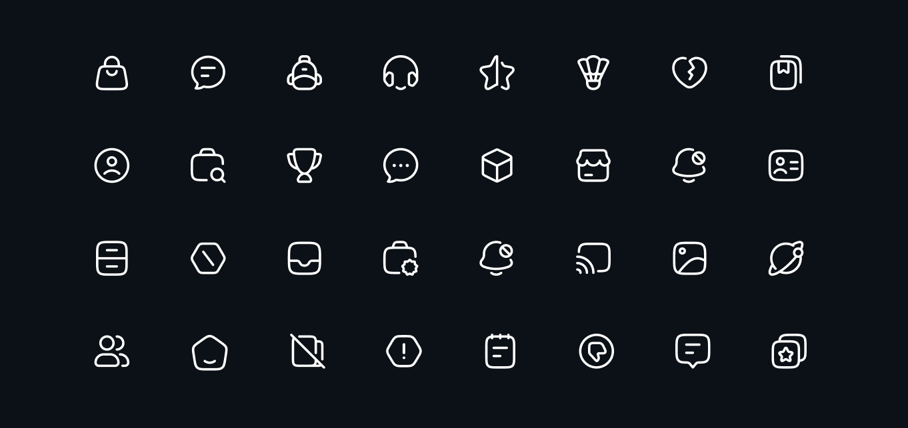

<div align="center">

<picture>
  <source media="(prefers-color-scheme: dark)" srcset="assets/logo/white.svg" />
  
</picture>

### Beautiful, consistent, pixel-perfect icons for every framework you build with.

**54,000+ icons** · **10 styles** · **5,400+ free** · crafted on a 24×24 grid and trusted by 500,000+ developers.

<br/>

[](https://hugeicons.com)
[](https://hugeicons.com/docs)
[](https://www.npmjs.com/package/@hugeicons/react)
[](LICENSE.md)

[**Browse icons →**](https://hugeicons.com/icons) · [**Documentation →**](https://hugeicons.com/docs) · [**Figma →**](https://hugeicons.com/figma-icon-library)

</div>

<br/>

<div align="center">
  
</div>

<br/>

## Why Hugeicons

Every icon is hand-crafted for consistency, clarity, and balance, so your interface looks sharp at any size, in any style. One design language, available natively wherever you work.

- **10 styles:** Stroke, Solid, Bulk, Duotone and Twotone across rounded, sharp, and standard families
- **Pixel-perfect:** built on a 24×24 grid for crisp rendering at any scale
- **Tree-shakeable:** ship only the icons you use
- **Native everywhere:** first-class libraries for React, Vue, Svelte, Angular, React Native and Flutter
- **5,400+ free icons:** for unlimited personal and commercial use
- **Always growing:** new icons added regularly

<br/>

## Packages

Pick your framework and install:

| Framework | Package | Latest | Install |
| --- | --- | --- | --- |
| **React** | [`@hugeicons/react`](packages/react) | [](https://www.npmjs.com/package/@hugeicons/react) | `npm i @hugeicons/react @hugeicons/core-free-icons` |
| **Vue** | [`@hugeicons/vue`](packages/vue) | [](https://www.npmjs.com/package/@hugeicons/vue) | `npm i @hugeicons/vue @hugeicons/core-free-icons` |
| **Svelte** | [`@hugeicons/svelte`](packages/svelte) | [](https://www.npmjs.com/package/@hugeicons/svelte) | `npm i @hugeicons/svelte @hugeicons/core-free-icons` |
| **Angular** | [`@hugeicons/angular`](packages/angular) | [](https://www.npmjs.com/package/@hugeicons/angular) | `npm i @hugeicons/angular @hugeicons/core-free-icons` |
| **React Native** | [`@hugeicons/react-native`](packages/react-native) | [](https://www.npmjs.com/package/@hugeicons/react-native) | `npm i @hugeicons/react-native @hugeicons/core-free-icons react-native-svg` |
| **Flutter** | [`hugeicons`](packages/flutter) | [](https://pub.dev/packages/hugeicons) | `flutter pub add hugeicons` |

<br/>

## Plugins

Use Hugeicons directly inside your design and no-code tools:

| Plugin | Get it |
| --- | --- |
| **Figma** | [Figma Community](https://www.figma.com/community/plugin/1209922740177393208/hugeicons-pro) |
| **Framer** | [Framer Marketplace](https://www.framer.com/marketplace/plugins/hugeicons/) |
| **Webflow** | [Webflow Apps](https://webflow.com/apps/detail/hugeicons) |

<br/>

## Tools

| Tool | Get it |
| --- | --- |
| **MCP Server** | [`@hugeicons/mcp-server`](https://www.npmjs.com/package/@hugeicons/mcp-server) · [source](tools/mcp-server) |

<br/>

## Quick start

Here's React. Every other framework follows the same shape (see each package's README for details):

```jsx
import { HugeiconsIcon } from '@hugeicons/react';
import { SearchIcon } from '@hugeicons/core-free-icons';

function App() {
  return (
    <HugeiconsIcon
      icon={SearchIcon}
      size={24}
      color="currentColor"
      strokeWidth={1.5}
    />
  );
}
```

The framework libraries are renderers. The icons themselves come from:

- **Free:** [`@hugeicons/core-free-icons`](https://www.npmjs.com/package/@hugeicons/core-free-icons) (5,400+ icons)
- **Pro:** `@hugeicons-pro/core-*` (54,000+ icons across 10 styles)

<br/>

## Free & Pro

|  | Free | Pro |
| --- | --- | --- |
| Icons | 5,400+ | 54,000+ |
| Styles | Stroke Rounded | 10 styles (Stroke, Solid, Bulk, Duotone, Twotone × variants) |
| Use | Personal & commercial | Personal & commercial |
| License | [MIT](LICENSE.md) | [Pro License](https://hugeicons.com/license-agreement) |

Upgrade any time. [Explore Pro](https://hugeicons.com/pricing).

<br/>

## Community & contributing

- Browse and search every icon at [hugeicons.com/icons](https://hugeicons.com/icons)
- Read the full docs at [hugeicons.com/docs](https://hugeicons.com/docs)
- Found a bug or have a request? [Open an issue](https://github.com/hugeicons/hugeicons/issues)
- Questions and ideas are always welcome

<br/>

## License

The free icons and all source code here are released under the [MIT License](LICENSE.md).
Pro icon packs require a valid [Hugeicons Pro license](https://hugeicons.com/license-agreement).

<div align="center">
<br/>

Made with care by [Hugeicons](https://hugeicons.com)

</div>
